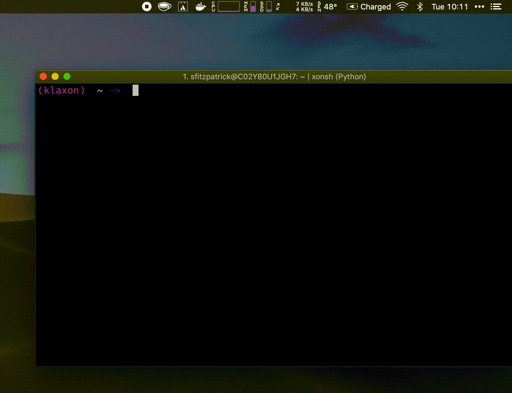

# klaxon

Send Mac OS (or [notifiers][notifiers]) notifications from the terminal or Python programs.

This is especially useful for when you want a push notification 
for some long-running background task.

Similar to the [terminal-notifier ruby gem][terminal-notifier],
but posix-compliant and able to send notifications via
the [notifiers][notifiers] library.



## Installation
For command-line use, the recommended method of installation is through [pipx].
```bash
pipx install klaxon
```
Naturally, klaxon can also be pip-installed.
```bash
pip install klaxon
```

## Usage

### terminal

```bash
# blank notification
klaxon
# with custom message
klaxon --message "this is the message body"
# pipe message from other program
echo "this is the message body" | klaxon --
```

### python

```python
from klaxon import klaxon, klaxonify

# send a notification

klaxon(
    title='hello, klaxon',
    subtitle='hola',
    message='it me'
)

# we can decorate our functions to have
# them send notifications at termination

@klaxonify
def hello(name='world'):
    return f'hello, {name}'


@klaxonify(title='oh hai', output_as_message=True)
def foo():
    return "This will be the message body."

```

## Non-MacOS Notifications 

### i.e. mobile | email | slack

You'll need to install klaxon with the `notifiers` extra.

```bash
pipx install klaxon[notifiers]
```

You will need a `~/.config/klaxon/config.toml` or `pyproject.toml` file with the
`tool.klaxon` namespace configured at the top level. Values from the latter will
override values in the former.

`enable-notifiers` will need to be set to `true` and you will need a `[[notifiers]]` key.

The latter will determine the parameters passed to the `notifiers.notify` method.

For example:

`~/.config/klaxon/config.toml`
```toml
enable-notifiers = true

[[notifiers]]
name = 'slack'
# see https://api.slack.com/incoming-webhooks#getting-started
webhook_url = {{your webhook url}}

[[notifiers]]
name = 'pushover'
user = {{your user token}}
token = {{your application token}}
```

Voila! Now messages sent from klaxon will be pushed to slack and pushover.


[terminal-notifier]: https://github.com/julienXX/terminal-notifier
[pipx]: https://github.com/pipxproject/pipx
[osascript]: https://apple.stackexchange.com/questions/57412/how-can-i-trigger-a-notification-center-notification-from-an-applescript-or-shel/115373#115373
[notifiers]: https://github.com/notifiers/notifiers